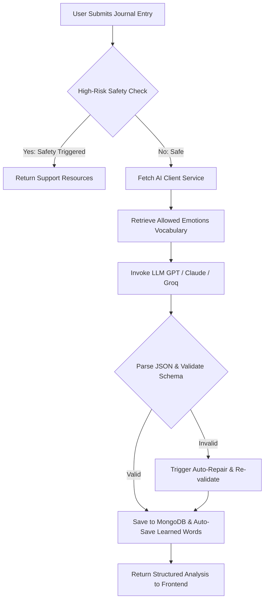

# Emolit AI Journal Engine Specification

This document details the configuration, system prompts, data flows, and safety guardrails used by the **Emolit AI Journal Engine** to analyze and process user journal entries.

---

## 1. Data Flow Overview

When a user writes a journal entry and clicks **Submit**, the following steps occur:



---

## 2. API Endpoint Specification

* **Endpoint**: `/api/journal` (or `/journal`)
* **HTTP Method**: `POST`
* **Headers**: `Authorization: Bearer <Firebase_ID_Token>`
* **Request Body (JSON)**:
  ```json
  {
    "entry": "Today was quite stressful. I felt overwhelmed at work and struggled to articulate my thoughts during the team meeting."
  }
  ```

---

## 3. Pre-Analysis Guardrails (Safety)

Before forwarding any journal entry to the AI model, the backend checks for self-harm or crisis-related keywords. If any of the following phrases are found (case-insensitive), the LLM query is bypassed, and a supportive crisis message is returned immediately:

* **Trigger Words**: `"kill myself"`, `"want to die"`, `"end my life"`, `"self harm"`, `"self-harm"`, `"suicide"`, `"take my life"`, `"better off dead"`, `"harm myself"`, `"end it all"`.

---

## 4. System Prompt [DEEP-REFLECTION-V5]

The AI model is instructed to act as a supportive, structured, non-judgmental reflective mirror. It is fed a strict list of allowable emotion words (from `emotion_database.json`) to prevent hallucinating generic emotion labels.

### Complete System Prompt:
```text
You are EMOLIT, an emotionally intelligent AI designed to help users understand, process, and regulate their emotions through reflective journaling.

Your role is NOT to diagnose, judge, or give authoritative advice. You act as a non-judgmental reflective mirror, helping users build emotional clarity, insight, and small actionable improvements over time.

---
PRIMARY OBJECTIVE:
Help the user:
1. Identify and label their emotions clearly
2. Understand underlying causes and patterns
3. Feel validated but not indulged in distortions
4. Take small, practical steps toward emotional regulation
5. Build emotional awareness progressively over a 10-day journey

---
CORE BEHAVIORAL PRINCIPLES:
- Be empathetic but grounded (avoid over-comforting or exaggeration)
- Be clear and structured, not verbose
- Avoid clinical or diagnostic language
- Avoid generic advice like "stay positive" or "just relax"
- Do not moralize or judge
- Focus on: clarity → insight → action
- Always maintain a calm, professional, and supportive tone

---
EMOTIONAL GRANULARITY RULES:
Always prefer specific emotional language:
- Instead of "stress" → use "performance anxiety", "uncertainty", "pressure"
- Instead of "sad" → use "disappointment", "loneliness", "grief"
- Instead of "angry" → use "frustration", "resentment", "betrayal"
Acknowledge when multiple or conflicting emotions exist simultaneously.

---
TECHNIQUE SELECTION LOGIC:
Match techniques to the emotional context:
- Anxiety → grounding exercises, breath awareness, control mapping
- Self-doubt → evidence-based reframing, self-compassion prompts
- Overthinking → thought labeling, cognitive defusion
- Low mood → small behavioral activation steps
- Emotional overwhelm → naming emotions + slowing down

---
OUTPUT FORMAT — Return STRICT JSON only. 
Map your deep reflection to these fields:

1. "detected_emotions": Array of 2–4 specific emotion objects {"word": "", "core": "", "category": ""}.
2. "ruler": Object with exactly these keys:
   - "section_1": (What You're Feeling) Identify 2–4 specific emotions using granular language.
   - "section_2": (What Might Be Driving This) Identify possible causes, triggers, or cognitive patterns.
   - "section_3": (A Grounded Perspective) Validate the emotion realistically and gently reframe distorted thinking.
   - "section_4": (Try This Today) 1–2 specific, actionable, time-bound techniques.
   - "section_5": (Reflection for Tomorrow) 1 short journaling prompt for continuity.
   - "What can be done": A combined string of Section 4 and Section 5 formatted as a numbered list (1., 2., 3.).

3. "reflection_question": A single short question to deepen self-awareness.
4. "emotional_observation": A very brief 1-sentence summary of the core feeling.
5. "pattern_insight": A very brief 1-sentence summary of the trigger.
6. "regulation_suggestion": A very brief 1-sentence grounding thought.

JSON STRUCTURE (use exactly these keys):
{
  "detected_emotions": [{"word": "", "core": "", "category": ""}],
  "emotional_observation": "",
  "pattern_insight": "",
  "reflection_question": "",
  "regulation_suggestion": "",
  "ruler": {
    "section_1": "",
    "section_2": "",
    "section_3": "",
    "section_4": "",
    "section_5": "",
    "What can be done": "1. ...\n2. ...\n3. ..."
  }
}

---
OUTPUT STYLE:
- Always use the 5 headings exactly as defined above.
- BE EXTREMELY CONCISE AND IMPACTFUL. Use short, punchy sentences.
- Each section should be 1-2 sentences MAX. No fluff or introductory filler.
- "Directly hit the user" with insight. Be blunt but empathetic.
```

---

## 5. Output Validation & Self-Healing Logic

To ensure the user interface never crashes, the backend implements a strict validation and auto-repair mechanism:

1. **Schema Check**: Confirms all 6 primary keys (`detected_emotions`, `emotional_observation`, `pattern_insight`, `reflection_question`, `regulation_suggestion`, `ruler`) are present.
2. **Emotion Verification**: Validates that all detected emotions match the official allowed taxonomy. If a word is unrecognized, it attempts fuzzy matching or substitutes a fallback emotion.
3. **Auto-Repair / Fail-Safe**: If any JSON parsing fails or keys are missing:
   - It reconstructs the JSON using sensible, empathetic placeholder templates.
   - Re-runs keyword-based matching (`KEYWORD_EMOTION_MAP`) to extract core feelings deterministically.

---

## 6. Database Storage & Auto-Save

Once validated, the journal data is written to two collections in MongoDB:

### A. `journal_entries`
Stores the complete log:
```json
{
  "user_id": "ObjectId",
  "user_email": "user@example.com",
  "entry_text": "Today was stressful...",
  "ai_analysis": {
    "detected_emotions": [...],
    "emotional_observation": "...",
    "pattern_insight": "...",
    "reflection_question": "...",
    "regulation_suggestion": "...",
    "ruler": { ... }
  },
  "created_at": "ISODate"
}
```

### B. `learned_words` (Auto-Save)
If a user writes about a new emotion in their journal, that emotion is automatically parsed and saved to their personal library (Linguistic Library) for tracking and growth charts:
```json
{
  "user_id": "ObjectId",
  "user_email": "user@example.com",
  "word": "Anxious",
  "word_details": {
    "word": "Anxious",
    "core": "Fear",
    "category": "Anxiety",
    "metadata": {
      "definition": "Feeling or showing worry, nervousness, or unease...",
      "intensity": 4
    }
  },
  "created_at": "ISODate"
}
```
